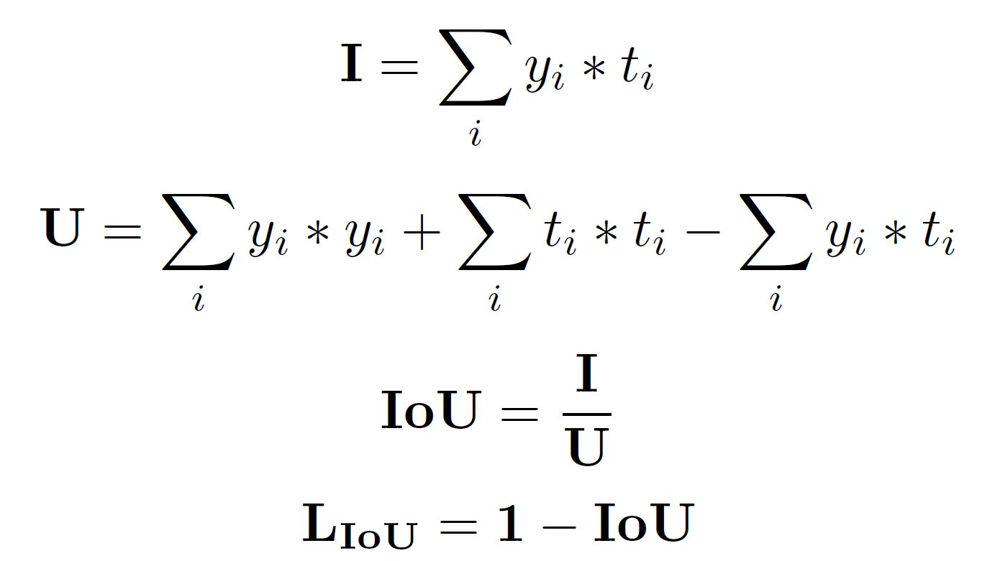

# 2D Hand Pose Estimation from RGB images using U-NET like model architecture.

#### Human  hand  pose  estimation  is  a  long  standing  problem in  the  computer  vision  and  graphics  research  fields,  with  a plethora of applications such as machine control, or augmented and virtual reality.

## Dataset

I have used Freihand Dataset
Link: https://lmb.informatik.uni-freiburg.de/resources/datasets/FreihandDataset.en.html
Extract the dataset in the folder notebook/data/FreiHAND_pub_v2/

## Exploratory Data Analysis

I have performed PCA on images and then true keypoints and considered first two principal components.
Then the plot was done plotting PC-1 vs PC-2.

PCA Plot of images:

PCA Plot of True keypoints:

## Training

Training is done at first with 146 epoch and then with 250 epoch. In all 2 cases batch size for training is 48.
rest of the configuration can be found in config.py file in utils folder.

## Model

I have used U-Net model with few changes

## Loss

I have used IoU Loss.

## Results:

Success Rate for different threshold values of error:

